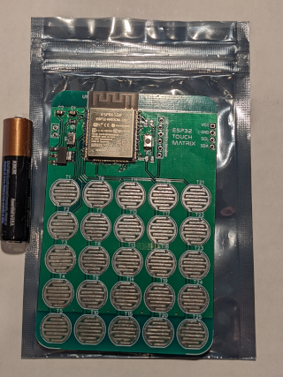

# ESP32-5x5-TouchPad

This board is an ESP32 WiFi based capacitive touch pad that I want to take advantage of to access MQTT and home automation. A new layout of the touch pad designed specifically for on/off and dim/bright. The idea being that a WiFi switch would allow control of a group of lights, such as the kitchen lights even if the different technologies such as ZigBee or Z-Wave. 

I found this ESP32-5x5-TouchPad board on Tindie and ordered two. Eventually I'll design my own but it's good to have something you can easily experiment with to do your research first. The company's web site is at [Electro Point4U](https://electropoint4u.com/product/esp32-touch-matrix/). There was no special reason I chose this one other that it was convient at the time. It did take time to ship from India.

And I found their code on github, which I forked here. The original code is Arduino/ESP32 enviroment base (use the Arduino IDE).

## Image of the front of the board

Image inline

Note that this board doesn't come with the FastLED ()

## Keypad layout

need a table here of the touch pads

| col 1 | col 2 | col 3 | col 4 | col 5|  |
| --- | --- | --- | --- | --- | --- |
| T1 | T6 | T11 | T16 | T21 | row 1 |
| T2 | T7 | T12 | T17 | T22 | row 2 |
| T3 | T8 | T13 | T18 | T23 | row 3 |
| T4 | T9 | T14 | T19 | T24 | row 4 |
| T5 | T10 | T15 | T20 | T25 | row 5 |

## License

Since the original License was GPLv3.0. Since this code is based on the code, it will continue to use the GPLv3.0 License.

## ESP32 Chips :construction:

Which chips have built-in support for touch sensor technology.

| Chip | Notes |
| --- | --- |
| ESP32 | No -S or -C |
| ESP32-C | |
| ESP32-S | |
| 8266 | |

ESP32-S2
Single-core Xtensa LX7 CPU, up to 240 MHz[6]
320 kiB SRAM, 128 kiB ROM, and 16 kiB of RTC memory
WiFi 2.4 Ghz (IEEE 802.11b/g/n)[7]
No Bluetooth
43 programmable GPIOs[8]
USB OTG
ESP32-C3

NodeMCU board with an ESP32-C3-32S
Single-core 32-bit RISC-V CPU, up to 160 MHz[9]
400 kiB of SRAM and 384 kiB ROM
WiFi 2.4 Ghz (IEEE 802.11b/g/n)[10]
Bluetooth 5 LE[10]
22 programmable GPIOs
Pin compatible with ESP8266
ESP32-S3
Dual-core Xtensa LX7 CPU, up to 240 MHz[11]
Added instructions to accelerate machine learning applications
384 kiB of RAM and an additional 384 KiB of SRAM
WiFi 2.4 Ghz (IEEE 802.11 b/g/n)[12]
Bluetooth 5 LE
44 programmable GPIOs
USB OTG

ESP32-C6
Single-core 32-bit RISC-V CPU, up to 160 MHz[13]
400 kiB of SRAM and 384 kiB ROM
IEEE 802.11ax (Wi-Fi 6) on 2.4 GHz, supporting 20 MHz bandwidth in 11ax mode, 20 or 40 MHz bandwidth in 11b/g/n mode
Bluetooth 5 and LE
22 programmable GPIOs
ESP32-H2
Single-core 32-bit RISC-V CPU, up to 96 MHz
256 KB of SRAM
IEEE 802.15.4 (Thread + Zigbee)
Bluetooth 5 LE
26 programmable GPIOs[14]

## Links :circus_tent:

* [Espressif ESP32 Docs](https://www.espressif.com/en/products/socs/esp32)
* [ESP32 Hardware Design Guidelines (English)](https://www.espressif.com/sites/default/files/documentation/esp32_hardware_design_guidelines_en.pdf)
* [Touch Sensor Design (English)](https://github.com/ESP32DE/esp-iot-solution-1/blob/master/documents/touch_pad_solution/touch_sensor_design_en.md)
